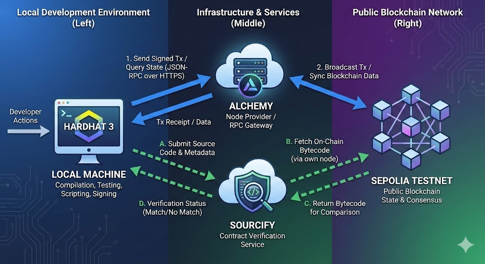
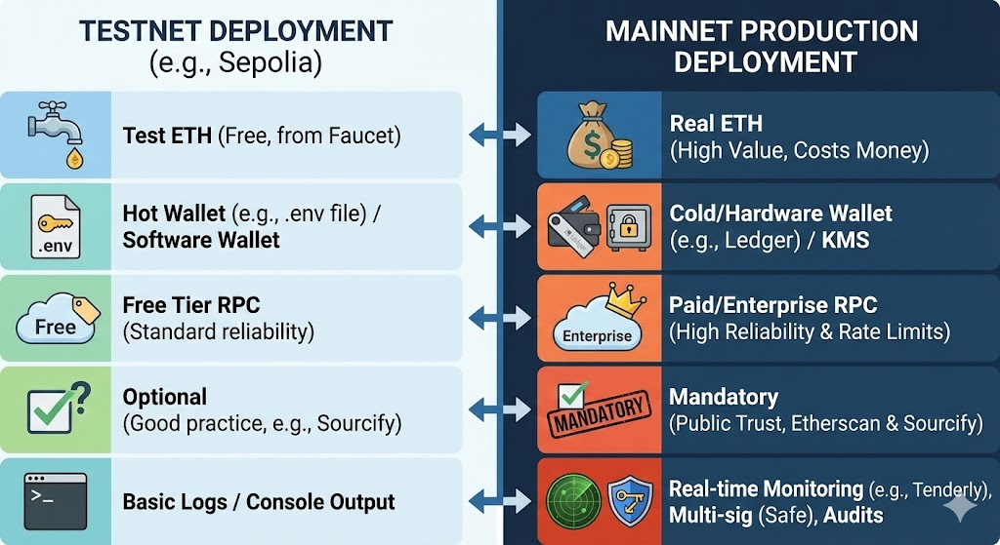
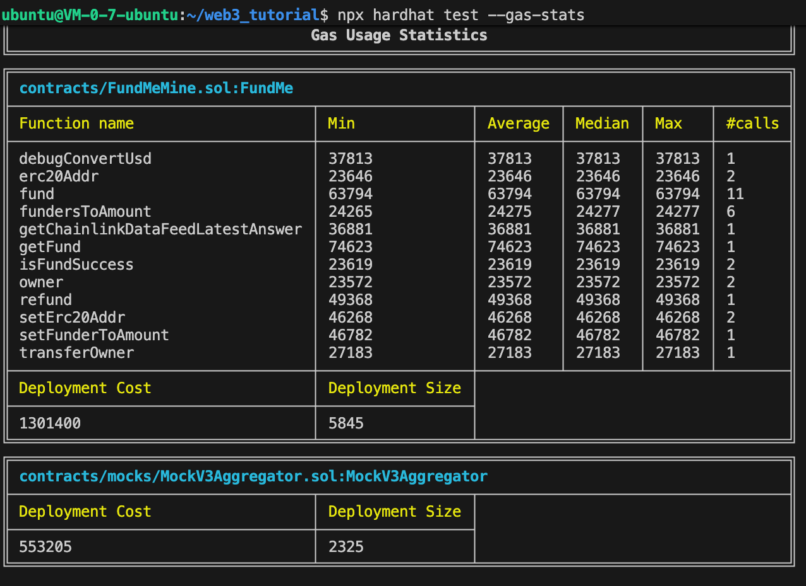

# FundMe 众筹智能合约项目-Harhat3

一个基于 Hardhat 3 的以太坊智能合约项目，使用 TypeScript 开发，包含了完整的众筹合约、单元测试、集成测试和 Ignition 部署模块。

## 项目功能概述

FundMe 是一个众筹智能合约，具有以下核心功能：

1. **募集资金** - 允许投资者向合约地址捐款
2. **投资记录** - 记录每个投资人的投资金额
3. **目标达成提款** - 达到目标金额后，项目方可以提取资金
4. **未达标退款** - 未达到目标时，投资人可以申请退款
5. **Chainlink 集成** - 使用 Chainlink 价格预言机获取 ETH/USD 价格

## 项目结构

```
web3_tutorial/
├── contracts/                    # 智能合约
│   ├── FundMeMine.sol            # 众筹合约主文件
│   └── mocks/
│       └── MockV3Aggregator.sol  # Chainlink价格聚合器的Mock合约
├── scripts/                      # 部署和验证脚本
│   ├── deployFundMe.ts           # 部署 FundMe 合约
│   ├── testSepolia.ts            # Sepolia 测试网测试
│   ├── verifySepolia.ts          # 验证 Sepolia 上的合约
│   └── getFundScript.ts          # 提款脚本
├── tasks/                        # Hardhat 自定义任务
│   ├── deploy-fundme.ts          # 部署任务
│   └── interact-fundme.ts        # 交互任务
├── ignition/modules/              # Ignition 部署模块
│   └── FundMe.ts                 # FundMe 部署配置
├── test/                         # 测试文件
│   ├── unit/                     # 单元测试
│   │   └── FundMeUnitTest.ts
│   └── staging/                  # 集成测试
│       └── FundMeSepoliaTest.ts
├── images/                       # 项目截图
├── Config.ts                     # 网络配置
├── hardhat.config.ts             # Hardhat 配置
├── package.json                  # 依赖配置
└── tsconfig.json                 # TypeScript 配置
```

## 环境配置

### 1. 安装依赖

```bash
npm install
```

### 2. 配置环境变量

创建 `.env` 文件，配置以下变量：

```env
# Sepolia RPC URL (从 Alchemy 或 Infura 获取)
SEPOLIA_RPC_URL=https://sepolia.infura.io/v3/YOUR_INFURA_KEY

# 私钥 (使用 keystore 或直接配置)
SEPOLIA_PRIVATE_KEY=your_private_key
SEPOLIA_PRIVATE_KEY_1=your_second_private_key

# Chain ID (可选，默认 31337)
CHAIN_ID=31337
```

### 3. 配置 Keystore (推荐)

使用 hardhat-keystore 插件安全存储私钥：

```bash
# 设置私钥
npx hardhat keystore set SEPOLIA_PRIVATE_KEY

# 查看已配置的账户
npx hardhat keystore list
```

## 合约参数

| 参数 | 值 | 说明 |
|------|-----|------|
| MIN_VALUE | 1 USD | 最小投资金额 |
| TARGET | 600 USD | 目标筹资金额 |
| 精度 | 10^8 | Chainlink 价格精度 |
| Solidity | 0.8.28 | 合约版本 |

## 部署方法

### 方法一：使用 Ignition 部署 (推荐)

Ignition 是 Hardhat 3 的声明式部署系统。

**部署到本地网络：**

```bash
npx hardhat ignition deploy ignition/modules/FundMe.ts
```

**部署到 Sepolia 测试网：**

```bash
npx hardhat ignition deploy --network sepolia ignition/modules/FundMe.ts
```

**查看已部署的合约：**

部署完成后，合约地址会保存在以下文件：
```
ignition/deployments/chain-11155111/deployed_addresses.json
```

### 方法二：使用 Hardhat 任务部署

**部署到本地网络：**

```bash
npx hardhat deploy-fundme
```

**指定锁定期（秒）：**

```bash
npx hardhat deploy-fundme --lock-time 300
```

### 方法三：使用脚本部署

**部署到本地网络：**

```bash
npx hardhat run scripts/deployFundMe.ts
```

**部署到 Sepolia：**

```bash
SEPOLIA_RPC_URL=https://sepolia.infura.io/v3/YOUR_KEY npx hardhat run scripts/deployFundMe.ts --network sepolia
```

部署脚本会自动：
1. 部署 MockV3Aggregator 合约（本地网络）
2. 部署 FundMe 合约
3. 验证合约（Sepolia）
4. 执行测试交易

## 验证合约

### 验证已部署的合约

```bash
# 验证 Sepolia 上的合约
npx hardhat run scripts/verifySepolia.ts --network sepolia
```

验证成功后会显示：
- 合约地址
- 所有者
- 锁定期
- Etherscan 链接

## 合约交互

### 方法一：使用 Hardhat 任务

```bash
# 与已部署的合约交互（充值测试）
npx hardhat interact-fundme
```

### 方法二：使用脚本

```bash
# 在 Sepolia 上测试已部署的合约
npx hardhat run scripts/testSepolia.ts --network sepolia
```

**注意：** 运行前需要设置合约地址：
```bash
# 方式1：设置环境变量
export FUNDME_CONTRACT_ADDRESS=0x...

# 方式2：直接运行
FUNDME_CONTRACT_ADDRESS=0x... npx hardhat run scripts/testSepolia.ts --network sepolia
```

### 方法三：使用 Cast 命令

```bash
# 查看合约余额
cast balance <CONTRACT_ADDRESS>

# 调用只读函数
cast call <CONTRACT_ADDRESS> "owner()"

# 发送交易
cast send <CONTRACT_ADDRESS> "fund()" --value 0.1ether --private-key <PRIVATE_KEY>
```

## 测试

### 运行所有测试

```bash
npm test
```

### 单元测试

使用 Hardhat 本地网络运行单元测试：

```bash
npx hardhat test test/unit/FundMeUnitTest.ts
```

**查看 Gas 统计：**

```bash
npx hardhat test --gas-stats
```

**查看测试覆盖率：**

```bash
npx hardhat test --coverage
```

单元测试包括：
- 构造函数测试 (owner, dataFeed, 初始状态)
- fund() 测试 (正常充值, 金额限制, 时间窗口)
- getFund() 测试 (达到目标提款, 权限验证)
- refund() 测试 (退款, 条件验证)
- 权限控制测试 (OnlyOwner 修饰符)

### 集成测试

在 Sepolia 测试网上运行：

```bash
npx hardhat test test/staging/FundMeSepoliaTest.ts --network sepolia
```

集成测试会验证：
- Chainlink 价格数据获取
- 真实充值交易
- 达到目标后的提款
- 退款流程

## 主要脚本说明

### deployFundMe.ts

完整的部署脚本，功能包括：
- 自动部署 Mock 合约（本地网络）
- 部署 FundMe 合约
- 验证合约（Sepolia）
- 执行测试充值
- 显示合约状态

### testSepolia.ts

Sepolia 测试脚本，用于测试已部署的合约：
- 测试只读函数
- 测试 fund() 函数
- 查询合约状态

### verifySepolia.ts

验证脚本，用于验证已部署的合约：
- 检查合约代码是否存在
- 读取合约信息
- 测试只读函数

### getFundScript.ts

提款脚本示例，演示如何调用 getFund() 或 refund() 函数。

## 合约函数说明

### 写入函数

| 函数 | 说明 | 条件 |
|------|------|------|
| fund() | 投资 ETH | ≥1 USD，窗口期内 |
| getFund() | 项目方提款 | 仅owner，达到目标，窗口期结束 |
| refund() | 投资方退款 | 窗口期结束，未达目标 |
| transferOwner() | 转移所有权 | 仅owner |
| setErc20Addr() | 设置ERC20地址 | 仅owner |
| setFunderToAmount() | 设置投资金额 | 仅ERC20合约 |

### 读取函数

| 函数 | 说明 |
|------|------|
| owner() | 获取合约所有者 |
| fundersToAmount(address) | 获取投资人投资金额 |
| getChainlinkDataFeedLatestAnswer() | 获取ETH/USD价格 |
| isFundSuccess() | 是否已成功提款 |
| debugConvertUsd(ethAmount) | 调试：ETH转USD |

## 网络配置

### 本地网络 (Hardhat)

- Chain ID: 31337
- 类型: EDR Simulated
- RPC: 自动创建

### Sepolia 测试网

- Chain ID: 11155111
- RPC: 配置在 SEPOLIA_RPC_URL
- dataFeed: 0x694AA1769357215DE4FAC081bf1f309aDC325306
- 区块确认数: 3

## 常用命令速查

```bash
# 编译合约
npx hardhat compile

# 运行所有测试
npm test

# 运行单元测试
npx hardhat test test/unit/FundMeUnitTest.ts

# 运行集成测试
npx hardhat test test/staging/FundMeSepoliaTest.ts --network sepolia

# 部署到本地
npx hardhat ignition deploy ignition/modules/FundMe.ts

# 部署到 Sepolia
npx hardhat ignition deploy --network sepolia ignition/modules/FundMe.ts

# 部署 (Hardhat 任务)
npx hardhat deploy-fundme

# 交互测试
npx hardhat interact-fundme

# 查看 Gas 报告
npx hardhat test --gas-stats

# 查看覆盖率
npx hardhat coverage
```

## 技术栈

- **框架**: Hardhat 3
- **测试**: node:test (Node.js 原生测试)
- **以太坊库**: viem
- **合约语言**: Solidity 0.8.28
- **构建工具**: TypeScript
- **价格预言机**: Chainlink
- **部署系统**: Hardhat Ignition

## 安全提示

1. **私钥管理**: 使用 keystore 或环境变量，不要硬编码私钥
2. **测试网优先**: 始终先在测试网验证合约逻辑
3. **权限控制**: 确保 owner 权限的私钥安全保管
4. **Gas 优化**: 部署前检查合约的 gas 消耗
5. **代码审计**: 生产部署前建议进行专业的代码审计

## 截图

### Ignition 部署


### 部署详情


### 测试结果
